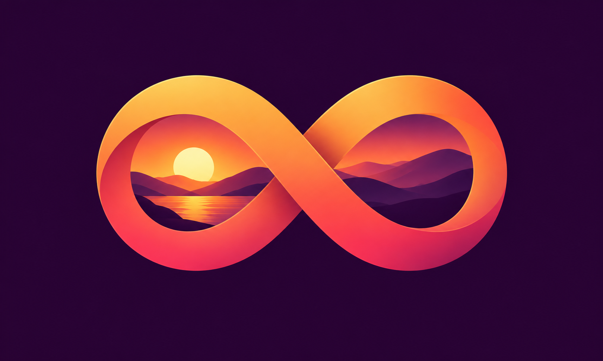

# Stillroom app icon concepts

Generated using the built-in image generation tool. Concept previews; not installed in the asset catalog.

## Shared prompt

Use case: logo-brand. Create one distinct polished app icon concept for Stillroom, an Apple TV app that continuously plays personal photo albums. Landscape canvas, aspect ratio 5:3. Full-bleed opaque background to all edges; no outer rounded-square container, no device mockup, no presentation board. Center the symbol with generous safe margins, large clear forms legible from across a room. No text, lettering, numbers, watermark, Apple logo, Photos flower, music notes or camera lens. This is a single icon image. Concept: 

## 01 — Looped Landscape

A bold continuous infinity ribbon forms two connected landscape photo windows, with simple mountain silhouettes and a sun integrated inside the loops. Periwinkle blue and luminous cyan on midnight navy. Elegant dimensional edges, extremely clean.

## 02 — Photo Orbit

Three overlapping white photo cards containing simplified colorful landscapes, encircled by one fluid blue looping arc. Deep indigo background, soft depth, bold memorable silhouette.

## 03 — Endless Frame

One sculptural rounded rectangular photo frame made from a continuous folded ribbon, with an elegant crossing fold along its bottom edge suggesting an endless loop. Within it a minimal blue mountain and warm sun. Rich blue background, polished satin white ribbon.

## 04 — Memory Carousel

A circular carousel of four chunky picture tiles in gentle perspective, each tile a simple landscape in blue, teal, coral or gold; open center and strong cohesive silhouette. Dark blue background. Refined dimensional illustration, no tiny details.

## 05 — Sunset Loop

A broad coral and amber infinity ribbon with its inner negative spaces revealing a stylized sunset landscape, a single sun and rolling hills. Deep plum background. Warm luminous gradients, bold minimal premium symbol.

## 06 — Glass Albums

Two overlapping translucent glass landscape-photo panels, rear panel blue and front panel cyan, front panel has large crisp mountain and sun shapes. A subtle continuous curved glass connector wraps the panels into a loop. Dark cobalt backdrop, restrained premium glass depth.

## 07 — Ribbon Play

A continuous broad periwinkle ribbon folds into a rounded triangular play symbol with a visibly looping tail that becomes the lower border of a landscape photo frame. Small stylized hill and sun integrated into the frame, midnight background. Simple bold geometric mark.

## 08 — Paper Memories

A tactile layered paper-cut landscape in a white photographic frame, teal mountains and amber sun, the bottom white border curls smoothly into an infinity loop beneath the picture. Warm cream backdrop with restrained soft shadows. Friendly sophisticated clean shape.

## 09 — Monoline Loop

A single thick luminous ice-blue continuous line forms a landscape picture outline and extends into a horizontal infinity loop at the bottom. One bold mountain zigzag and small sun inside. Deep almost black navy background, flat precise minimalist graphic, strong contrast.

